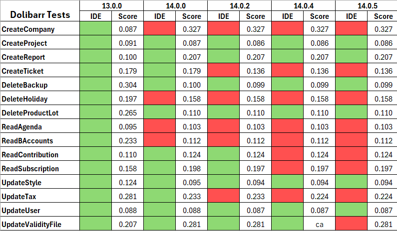
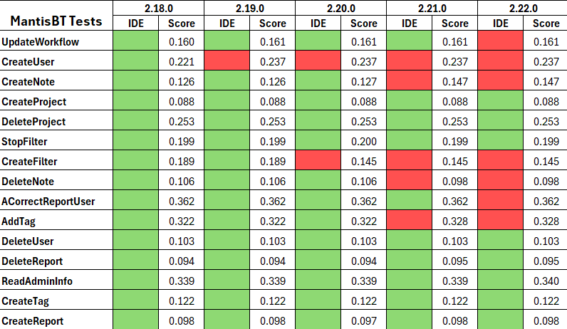
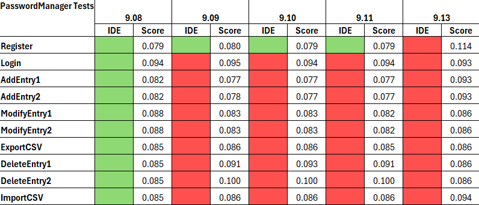
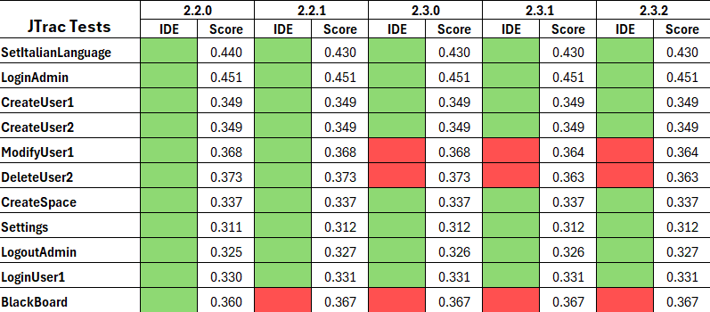
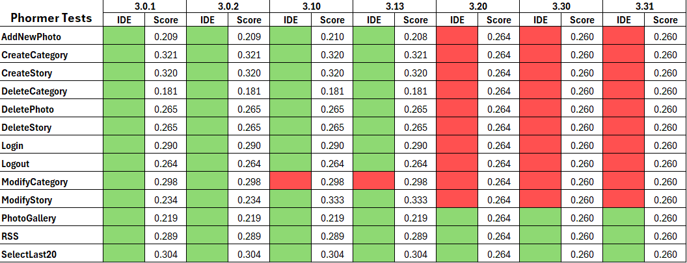

# FragilitySentry Overview

This project is the continuation of https://github.com/Noctino52/FragilitySentry. <br />
The project is still a work in progress, meaning this Readme overview will be updated once completed. <br/>
All the development process of this project took place in a Linux environment (Ubuntu 22, Ubuntu 23). <br />

## How to run tests

In this project 5 applications are tested. Here is the list with the versions: <br />

| Application         | Versions                                   |
|---------------------|--------------------------------------------|
| Dolibarr            | 13.0.0, 14.0.0, 14.0.2, 14.0.4, 14.0.5     |
| MantisBT            | 2.18.0, 2.19.0, 2.20.0, 2.21.0, 2.22.0     |
| Phormer             | 3.0.1, 3.0.2, 3.10, 3.13, 3.20, 3.30, 3.31 |
| JTrac               | 2.2.0, 2.2.1, 2.3.0, 2.3.1, 2.3.2          |
| Password Manager    | 9.08, 9.09, 9.10, 9.11, 9.13               |

First of all, this project uses JUnit to automate a battery of Selenium tests. <br />
Each battery of test (related to the specific application) is located in __src/test/java/JUnit/{name_of_the_application}__. <br />

### Step 1

In order to run tests you will need to start the related docker container. <br />
I recommend to run the versions I have listed above. <br />
* ___Run Dolibarr container___
    ```shell
        docker compose -f 'docker-compose(Dolibarr).yml' up -d
    ```
    Once It starts, the dolibarr application will probably be "exited". <br />
    What you want to do Is to go to http://localhost:8081/, login with (server: mysql, name: dolibarr, pass: dolibarr), select dolibarr database and import the .sql file I have provided inside the folder "dolibarr-db-dump". <br />
    Now stop and restart the docker container. <br />
    Last thing, please test the version starting from the version 13.0.0 if you don't want problems with the volumes installation. <br />    


* ___Run MantisBT container___
    ```shell
        docker compose -f 'docker-compose(MantisBT).yml' up -d
    ```
  Make sure you defined the correct version you want to test (inside the docker-compose file). <br />
  Once It starts, go to http://localhost:8080/, login with (server: mysql, name: mantisbt, pass: mantisbt), select bugtracker database and import the .sql file I have provided inside the folder "mantisbt-db-dump". <br />
  Stop and restart your container. <br />
  Before starting the test, you'll need to do several steps. In order:
  - Set the italian language: from your browser go to http://localhost:8989/login_page.php and login as "Administrator" (name: Administrator, pass: root) and then proceed to My Account > Preferences.
  - Logout and do the same for this other users: (name: Chris95, Miranda23 -- pass: root).
  - Login with user (name: Ivan52, pass: root) > Report Issue for EasyManager2 (fill category dropdown menu, Summary: "Glitch grafico", Description: "Glitch grafico che prima non si verificava").
  - Stop and restart your docker container. <br />


* ___Run Password Manager container___
    ```shell
        docker compose -f 'docker-compose(PasswordManager).yml' up -d
    ```
    Before executing the docker compose file, go to the __PasswordManagerVersions__ folder and choose a version you'd like to test. Then change it accordingly inside the docker-compose file. <br />
 

* ___Run JTrac container___
    ```shell
        docker build -t jtrac . && docker run --network host --name jtrac jtrac
    ```
  Go to the __JTracVersions__ folder and choose a version you'd like to test; then change it accordingly inside the Dockerfile. <br />


* ___Run Phormer container___
    ```shell
        docker build -t phormer . && docker run -d -p 80:80 --name phormer phormer
    ```
  This Docker file is located inside the __PhormerDockerfile__ folder. <br />
  Probably, once executed, you should go to http://localhost/ and register with password "admin". <br />
  To execute it, first save in another folder the Dockerfile provided for JTrac. After that substitute (global folder) Phormer's. <br />
  Before executing the Dockerfile, go to the PhormerVersions folder and choose a version you'd like to test; then change it accordingly inside the Dockerfile. <br />


### Step 2

To run the test and apply the metric It is really easy, what you have to do is: <br />
  1. Edit Run Configuration and insert as input parameter the version you want to test (make sure it exists in the related Result.csv file).
  2. Change one line of code located in JUnitRunner.java (located in src/test/java/), that is to say: <br />
  ```console
  static String SoftwareUsed = ""; // Insert here the name of the application.
  ```
Once the testing is finished you will find a Result.csv which contains a triple (for each execution): __{Test Name, Passed (true/false), Score}__. <br />
It is located in __src/test/java/XMLResult/{name_of_the_application_tested}__. <br />

## Applied Metric
Once the project is finished I will update this section. <br />
<!--
  
  
  
  
  
-->